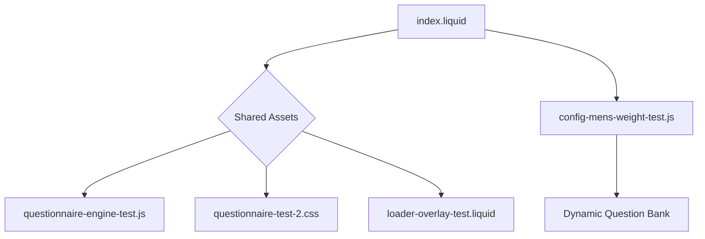

# 🩺 SehatUp Questionnaire Engine v3.6.3
### *The high-performance, medical-grade diagnostic engine for SehatUp*

---

## 🌟 Overview
The SehatUp Questionnaire is a sophisticated web application designed to provide users with clinical-grade health scores and personalized Ayurvedic treatment plans. It utilizes a **Dynamic Progression Engine** to adapt questions based on user input, ensuring a highly personalized medical assessment.

---

## 🏗️ Project Architecture

The project follows a **Shared-Core Pattern**, allowing multiple questionnaire types to run on the same engine.



---

## 🌀 Deep Dive: Loader Implementation
The loader is the most critical UI element for perceived performance. It operates in **four distinct phases**:

### 1. The "Safety-First" Initial State (CSS)
In `loader-overlay-test.liquid`, `#loader` is set to `display: flex` by default. 
**Why?** If the server is slow or the user refreshes a complex results page, we want a white screen with a loader **immediately**, not a flash of half-rendered data.

### 2. The "Fast-Hide" Bypasser (Inline JS)
Added to `index.liquid`, this script runs **before** the 1MB+ of Firebase and Engine scripts load.
```javascript
if (!localStorage.getItem('partialDocId_mens-weight')) {
    document.getElementById('loader').style.display = 'none';
}
```
**Logic:** If no partial ID exists, the user is new. New users landing on Step 1 should **never** see a loader. This kills the "flicker" instantly.

### 3. The Initialization Handshake (`Engine.init`)
Once `QuestionnaireEngine.js` loads:
- It checks the URL and LocalStorage.
- If it's a **Results Refresh**, it keeps the loader visible.
- It calculates a `minDuration` (usually 2000ms) to ensure the loader doesn't disappear too fast, which looks glitchy.

### 4. The Smooth Exit (`hideLoader`)
- **Instant Mode:** Used for home page skips.
- **Fade Mode:** 
  1. Adds `.fade-out` to the loader (0.8s opacity transition).
  2. Adds `.fade-in-content` to the active step (Slide-up animation).
  3. Sets `display: none` after 800ms.

---

## 🚀 Full Questionnaire Flow (Case Study: Men's Weight)

Here is the exact technical path a user takes from start to checkout:

### Step 1: Landing (Welcome)
- **Tech:** Liquid renders `step-1`.
- **Action:** User clicks "Start".
- **Trigger:** `showStep(2)`.

### Step 2: Lead Capture (Partial Submission)
- **Tech:** Form validation for Name/Phone/DOB.
- **Action:** Once validated, the engine checks for `partialDocId`.
- **Firebase:** Creates a document in `partial_submissions`. 
- **Persistence:** ID is saved to `localStorage`. If the user leaves now, the Marketing Portal already has their lead.

### Step 3: Health Metrics
- **Tech:** Calculates BMI on the fly.
- **Action:** User enters Height/Weight.
- **Trigger:** `validate-metrics` -> `showStep(4)`.

### Step 4 - 8: Dynamic Questions
- **Tech:** Engine loops through `config.questionGroups`.
- **Logic:** Each answer is stored in `state.allAnswers`. 
- **Visuals:** `updateStepIndicators()` updates the progress bar and desktop sidebar.

### Step 9: Finalization (The Calculation)
- **Action:** User answers the last question.
- **Trigger:** `finishQuestionnaire()`.
- **Logic:**
  1. Shows Loader.
  2. Sends full state to Firebase `questionnaire_submissions`.
  3. Deletes the temporary `partial_submissions` record.
  4. Calculates `healthScore` based on weighted answers in the config.

### Step 99: Result Page (The Render)
- **Tech:** `renderResults()` runs.
- **UI:** Score counts up from 0 to X. Product recommendations are filtered from the `product-database`.
- **Loader:** Fades out once rendering is complete.

### Step 100: OTP & Conversion
- **Action:** User clicks "Get Report on WhatsApp".
- **Tech:** `openOtpPopup()` -> `sendOtp()`.
- **API:** Calls the Cloud Function `generateotp`.
- **Final:** On success, redirects to WhatsApp and unlocks the "Buy Now" checkout link.

---

## 🛠️ Performance Tips for Improvisation
1. **Cache Busting:** Always update the version in `this.version = "3.6.4"` when changing logic to force browser refresh.
2. **Dynamic IDs:** Use the `config.id` variable instead of hardcoding 'mens-weight' to ensure logic works across all 4 quizzes.
3. **Z-Index:** Ensure the loader (`10000`) is always higher than the OTP modal (`9999`).

---
*Documented by Antigravity AI for SehatUp Engineering*

