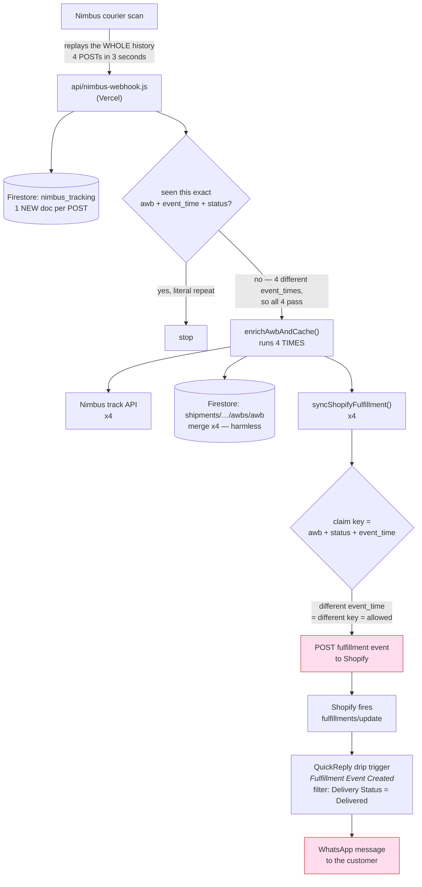
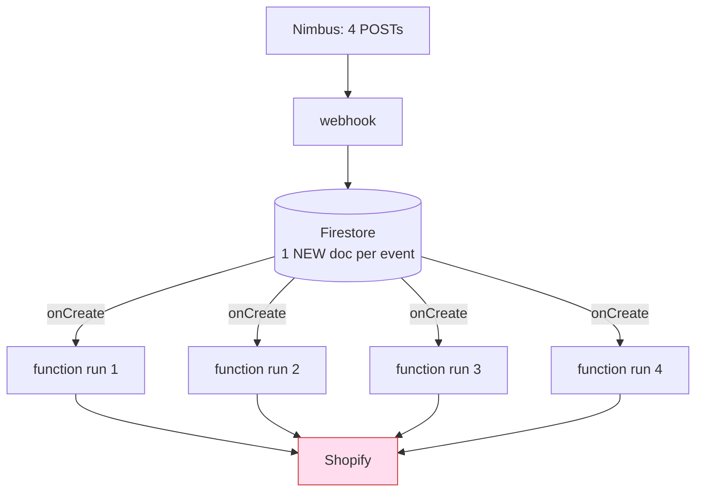
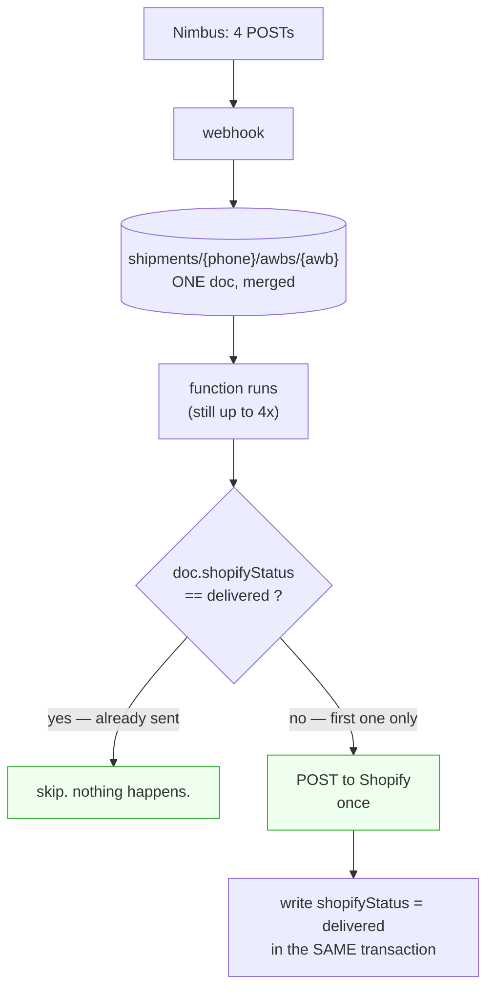
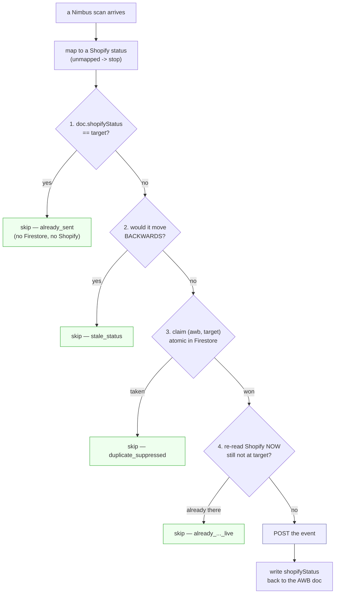
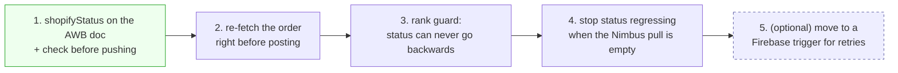

# Nimbus → Shopify status sync — how it works, and why it duplicates

Short answer to *"if Nimbus writes to Firebase and a Firestore trigger runs the
function, does the burst go away?"*

> **No — not on its own.** A Firestore trigger fires **once per document write**.
> Four Nimbus POSTs still become four function runs.
>
> But the idea is half right: it goes away if the writes land on **one document
> per shipment** and the function checks **what was already sent to Shopify**
> before sending. That second half is the fix — and it works on Vercel too.

---

## 1. What happens today



**Measured over the last 35 days:**

| | |
|---|---|
| shipments that reached `delivered` | 43 |
| …that posted `delivered` **more than once** | **9 (21%)** |
| extra duplicate `delivered` events | **9** → 9 extra drip enrolments |
| fulfillments with *any* repeated status | 16 of 56 |
| shipments whose status went **backwards** | 1 |

And the duplicates are **not** concurrent bursts — they are minutes to hours apart:

```
#1872   delivered 12:49:59   then   delivered 13:07:11      (17 min)
#1868   delivered 13:49:31   then   delivered 14:05:23      (16 min)
#1864   out_for_delivery 10:57 → delivered 12:23 → out_for_delivery 12:41 → delivered 16:10
```

### Why the existing guard misses them

`shopify-fulfillment.js` claims on `(awb, status, event_time)`.

Nimbus emits **several different scans that mean the same thing** — "In Transit"
at hub A 17:34 and hub B 17:35, a delivery scan and a POD-upload scan. Different
`event_time` → different key → the claim succeeds → it posts again.

The claim was built to stop *simultaneous* replays. It does that. It was never
able to stop *sequential* scans that map to one status.

---

## 2. Your idea, exactly as described



**Still four.** A trigger is not a queue that merges things — it fires per write.
Moving the function from Vercel to Firebase changes *where the code runs*, not
*how many times it runs*.

---

## 3. What actually collapses the burst

Two changes. Neither of them needs Firebase.

### (a) One document per shipment, not per event



### (b) Remember what Shopify was already told

Right now **nothing anywhere records this.** `enrich.js` writes the shipment doc,
calls `syncShopifyFulfillment()`, and then only *logs* the result — it is never
written back. The claims collection is a stand-in for that memory, and it is
keyed on the wrong thing.

Put the memory on the shipment itself:

```js
// shipments/{phone}/awbs/{awb}
shopifyStatus:   "delivered",                  // last status actually pushed
shopifyStatusAt: "2026-08-03T12:49:59+05:30",
```

Then the rule is one line, and it is exactly *"reject if the status is already
there"*:

```js
if (target === doc.shopifyStatus) return { skipped: true, reason: 'already_sent' };
```

Keyed on the **shipment**, not the event. Five Nimbus scans meaning "delivered"
now produce **one** Shopify event, forever — no matter how far apart they arrive,
no matter which host runs the code.

---

## 4. Side by side

| | today | move to Firebase only | add the status memory |
|---|---|---|---|
| 4 POSTs → function runs | 4 | 4 | 4 |
| → Shopify events | **up to 4** | **up to 4** | **1** |
| → WhatsApp messages | up to 4 | up to 4 | **1** |
| survives claim docs being purged | no | no | **yes** |
| works minutes/hours apart | no | no | **yes** |
| needs a migration | — | yes | no |

**The row that matters is "→ Shopify events".** Only the last column changes it.

---

## 5. Where Firebase *does* help

Not for dedupe — for two other things, and only **after** the status memory exists:

- **Transactions.** Read `shopifyStatus` and set it atomically in one round trip
  via the Admin SDK. The current raw-REST create-if-absent works, but this is
  cleaner and impossible to race.
- **Automatic retries.** Today `syncShopifyFulfillment()` never throws — a failed
  push is logged and you wait up to 24 h for the cron. A Firestore-triggered
  function retries by itself.

> ⚠️ **Retries are dangerous until the memory exists.** Retrying a POST that
> creates a fulfillment event just creates another one. `shopifyStatus` is what
> makes a retry safe, so it has to come first either way.

### Costs of the move

- The Nimbus webhook **must stay on Vercel** — it is the public URL Nimbus posts
  to. So you add a hop, you don't remove one.
- One pipeline across two platforms: two deploy targets, two sets of env vars,
  two places to read logs.

---

## 6. What was built (2026-08-07) — all on Vercel

Four guards, cheapest first. Each returns before the next costs anything, so the
common no-op does no network work at all.



| Guard | Where | Catches |
|---|---|---|
| 1 · `shopifyStatus` on the AWB doc | `enrich.js` reads it off the PATCH response (no extra read) and passes it in | the same status arriving again, ever — survives the claims collection being purged |
| 2 · rank guard | `confirmed(1) < in_transit(2) < out_for_delivery(3) < delivered(4)` | a replayed old scan walking the order backwards (#1864) |
| 3 · claim on `(awb, target)` | `shopify-fulfillment.js`, event time removed from the key | everything else — concurrent bursts *and* scans hours apart |
| 4 · re-read the order before writing | one Shopify GET, only on the path about to write | the caller's `order` snapshot being minutes stale |

**`attempted_delivery` and `failure` are exempt from all four equality checks.** A
second failed delivery attempt is genuinely new information; a second "delivered"
never is. (The test suite caught this — the first cut blocked legitimate repeat
attempts.)

And in `enrich.js`: when the Nimbus pull returns **no history**, the status fields
are omitted from the write entirely rather than falling back to the replayed
webhook event, and the Shopify push is skipped. `PATCH` uses an updateMask, so
omitting them preserves what is stored. This closes the feedback loop where a
regressed `status` made `isTerminal()` false and the daily cron re-enriched a
delivered shipment forever.

### Verified against the real duplicates

`node api/_lib/shopify-fulfillment.test.mjs` — 18 checks, including replays of the
actual event sequences pulled from Shopify:

```
#1872  7 scans -> 4 events, delivered exactly once   (was: delivered x2)
#1868  6 scans -> 3 events                           (was: 3 statuses x2)
#1864  never walks backwards after delivered         (was: OFD after delivered)
```

The stub models Shopify's live `shipment_status` separately from the caller's
snapshot, because judging on the stale snapshot is what caused every duplicate.

### Deploying

Nothing to migrate. Existing claim docs are keyed the old way, so a shipment that
already posted `delivered` finds no matching claim — but guards 1, 2 and 4 all
catch it (the order already reads `delivered`), so no duplicate goes out. The new
`shopifyStatus` field fills in on the next scan of each shipment.

---

## 7. Original plan, for reference



1. **`shopifyStatus` + check** — kills all 9 duplicates. One field, one `if`.
2. **Re-fetch the order immediately before posting** and compare
   `shipment_status`. Second line of defence if the field is ever missing.
3. **Rank guard** — `confirmed(1) < in_transit(2) < out_for_delivery(3) <
   delivered(4)`, with `failure` / `attempted_delivery` allowed to interrupt.
   Kills the `delivered → out_for_delivery` regression seen on #1864.
4. **Don't let a webhook event alone set `status`** when the Nimbus pull came
   back empty (`enrich.js:356` falls back to the replayed event). A regressed
   status makes `isTerminal()` false, so the daily cron re-enriches a delivered
   shipment forever — which is another source of repeated Shopify writes.

Steps 1–4 are contained, need no migration, and stay correct if you later do 5.

---

## 8. One more thing, unrelated to duplicates

`nimbus_tracking` is **append-only with no TTL**. Every raw webhook — including
every replayed old event — is kept permanently. `claim.js` documents TTL policies
for `nimbus_events_seen` and `shopify_sync_claims`, but those have to be switched
on by hand in the Firebase console (worth checking whether that was ever done),
and nothing covers `nimbus_tracking` at all.
